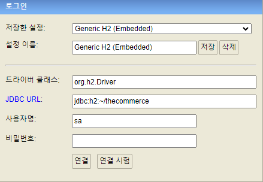
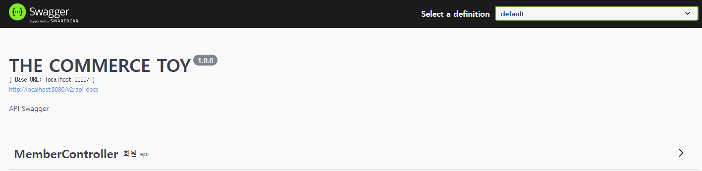

# TOY
### 간단한 회원 기능을 담당하는 새로운 restful api 백엔드 서버 제작

환경 : springboot, jdk1.8, spring JPA, H2

H2 설치 및 세팅

1. H2 데이터베이스의 공식 웹사이트(https://www.h2database.com/html/main.html)에서 
H2 데이터베이스의 최신 버전을 다운로드합니다.

2. 사진과 같이 Embedded로 test 스키마를 생성하고 연결합니다.

API 테스트
1. http://localhost:8080/swagger-ui/index.html 에 접속하여 작성된 api를 테스트 할 수 있습니다.

2. api 사용시 BindingResult가 메소드에 포함되어 있다면 AOP를 적용한 BindingAdvice를 통해 에러를 처리하도록 구현했습니다.

3. 예외처리는 @RestControllerAdvice (ExceptionAdvice.class) 및 @ExceptionHandler를 사용하여 구현했으며
예외처리시 @EventListener를 사용하여 로그를 남기도록 구현했습니다.

